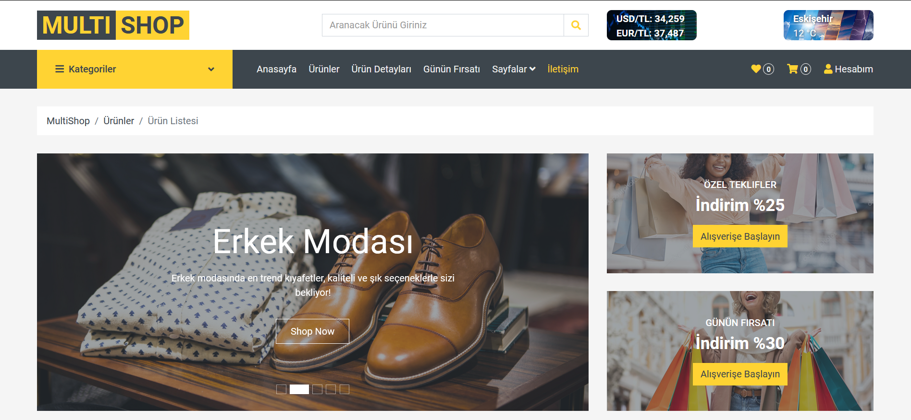
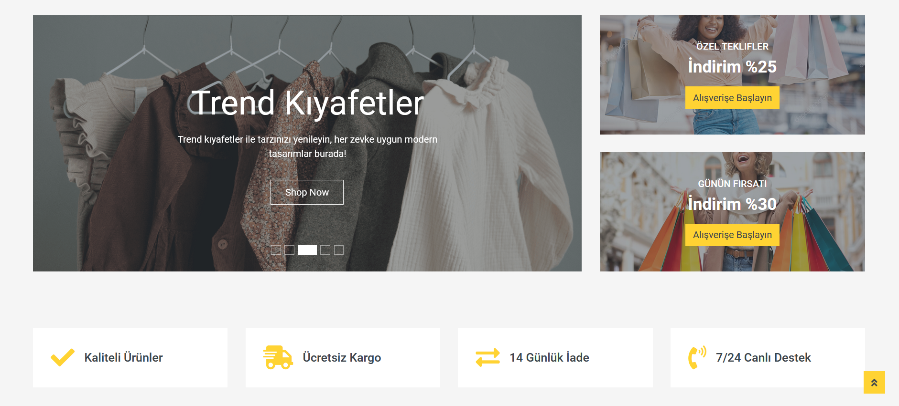
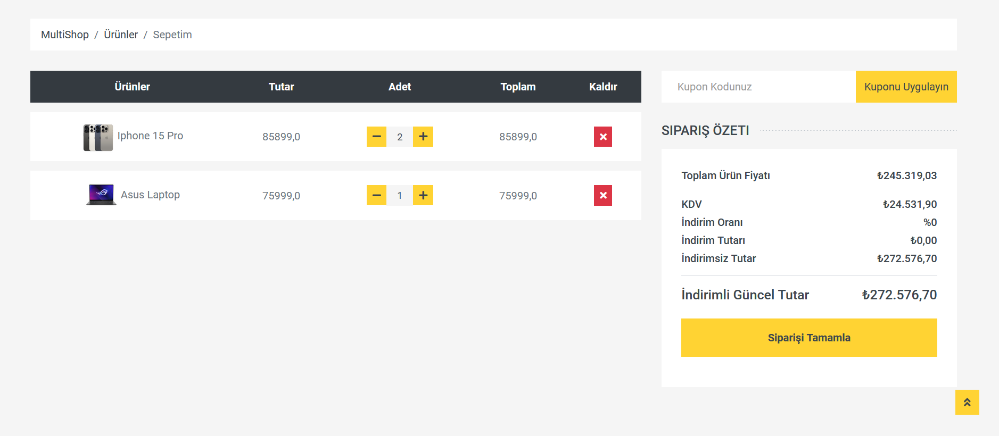
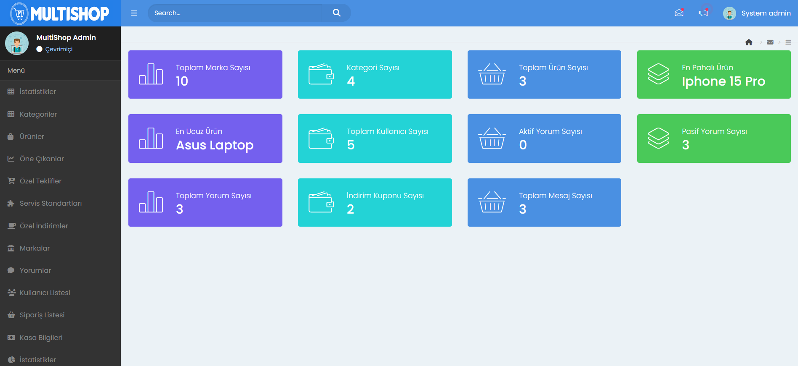
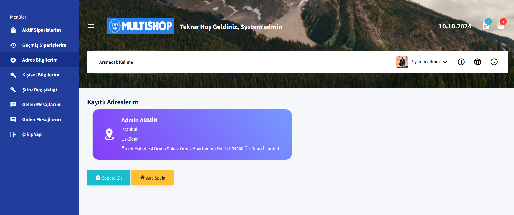

**ASP.NET CORE MICROSERVICE E-TRADE PROJECT**

- Bu proje mikroservis mimarisiyle oluþturulmuþ bir e-ticaret projesidir. Her bir mikroservis baðýmsýz olarak çalýþabilen ve belirli görevleri yerine getiren baðýmsýz servislerden oluþmaktadýr.
- Ana sayfada kategorileri görüntüleyebilir, kategorilere ait ürünleri listeyebilir, sepetinize ekleyebilir, ürün detayýna giderek ürün hakkýndaki açýklamalarý ve yorumlarý listeleyebilir ve özel teklifleri görüntüleyebilirsiniz.
- Sepete eklenen ürünleri Sipariþi Tamamla ile adres ve kargo bilgisi için Order adýmýna yönlendirir. Kargo adresi varsa güncelleyebilir yoksa ekleyebilir ve Ödeme adýmýna geçer. Kart bilgileri girildikten sonra Sipariþ Onayý maili göndererek sipraiþ iþlemi tamamlanýr.
- Dosyanýn en altýnda projeye ait bazý ekran görüntüleri bulunmaktadýr. Daha fazlasý için **Frontends -> MultiShop.WebUI -> wwwroot -> assets** klasörü altýndan ulaþabilirsiniz.

**Kullanýlan Teknolojiler:**

- .Net 8
- Docker
- Portainer
- MongoDB
- PostgreSQL
- MSSQL
- Redis
- IdentityServer4
- OcelotGateway
- Dapper
- Entity Framework
- AJAX
- Onion Architecture
- CQRS & Mediator Design Pattern
- N-Tier Design Pattern
- Dependency Injection (DI) Design Pattern
- AutoMapper ( Dto - Entity dönüþümleri için )
- FluentValidation
- Mimekit ( Ödeme adýmý sonrasý Sipariþ Onayý mail gönderimi için )
- RapidApi ( Ana Sayfada Döviz Kuru ve Hava Durumu bilgisi için )

**Mikroservisler**

- Tüm mikroservisler kullanýcý giriþine gerek olsun veya olmasýn token ile koruma altýna alýnmýþtýr.

**1. Catalog Mikroservisi:** Kategoriler ve kategorilere göre ürünlerin listelendiði, öne çýkan ürünlerin, özel indirimlerin, servis standartlarýnýn ve markalarýn listelendiði ve yönetildiði mikroservistir.
Bu mikroserviste veriler Mongo DB veritabanýnda saklanýr. Bu mikroservis kullanýcý giriþi yapýlarak alýnan token deðerine gerek kalmadan fakat client credential token ile koruma altýna alýnmýþtýr.
Bu mikroservis;

- Site hakkýndaki bilgileri,
- Kategorileri,
- Öne çýkan ürünleri,
- Özel teklifleri,
- Ürün detaylarýný (Açýklama, Görseller),
- Sitenin sunmuþ olduðu servis standartlarýný,
- Özel indirimleri,
- Markalarý
- Öneri, talep veya þikayetlerin iletilebileceði bir iletiþim sayfasýnýn görüntülenmesi, yeni veri eklenmesini, güncellenmesini ve silinmesini saðlar.

**2. Basket Mikroservisi:** Sepete eklenen ürünleri listeleyebilir, sepete ürün eklenmesi veya çýkarýlmasý, sepetinizde bulunan ürünlerin ve toplam fiyatýn hesaplanmasý ve gösterilmesi görevlerini yerine getirir.
- Sepete ürün ekleyebilmek için kullanýcýnýn sisteme giriþ yapmýþ olmasý gerekmektedir. Eðer herhangi bir üyelik kaydý yoksa kolay bir þekilde kayýt olup giriþ yaptýktan sonra sepeti görüntüleyebilir.
- Bu mikroserviste veriler Redis'te tutulmaktadýr. Docker'da ayaða kaldýrýlmýþtýr cloud ortamda tutulmaktadýr.

**3. Cargo Mikroservisi:** Bu mikroservis N-katmanlý mimari kullanýlarak geliþtirilmiþtir. Veriler veritabaný olarak Docker üzerinde ayaða kaldýrýlmýþ tamamen cloud ortamda bulunan bir MSSQL üzerinde tutulmaktadýr. 
Kargo iþlemlerinin yapýlabilmesi için kullanýcýnýn sisteme giriþ yapmýþ olmasý gerekmektedir.

Bu mikroservis;
- kargo þirketlerinin,
- kargo müþterilerinin,
- kargo detaylarýný ve
- kargo hareketlerinin veri eklenmesi, güncellenmesi, çýkarýlmasý ve listelenmesi görevlerini yerine getirir.

**4. Comment Mikroservisi:** Kullanýcýlarýn ürünlere ait yorumlarýný yapmasýný saðlayan mikroservistir. Veriler veritabaný olarak Docker üzerinde tamamen cloud ortamda ayaða kaldýrýlmýþ bir MSSQL veritabaný üzerinde tutulmaktadýr.
Bu mikroservis ile;

- Kullanýcýlar bir ürünün detaylarýna giderek ürün hakkýnda yorumlarýný yapabilirler ve ürün detayýnda o ürüne yapýlmýþ yorumlarý listeleyebilirler.
- Ürüne yorum yapabilmek için kullanýcýnýn giriþ yapmasý zorunlu kýlýnarak mikroservis token ile koruma altýna alýnmýþtýr.

**5. Discount Mikroservisi:** Bu mikroservis ile indirim kuponu oluþturulabilir ve sepet ekranýnda kupon kodu uygulanarak indirim saðlanabilir. Bu mikroservis indirim kuponu oluþturulmasýný saðlar. Ýndirim kuponlarý sisteme giriþ yapýldýktan sonra Admin paneli üzerinden yapýlmakatdýr.
- Veriler MSSQL veritabanýnda Dapper kullanýlarak tutulmaktadýr.

**6. Message Mikroservisi:** Kullanýcýlarýn sistem adminine mesaj göndermesini ve gelen mesajlarýn listelenmesini yapmaktadýr. Kullanýcýlar sadece admine mesaj gönderebilir. Kendi aralarýnda bir mesajlaþma yapamazlar. Mesaj iþlemleri Kullanýcý paneli üzerinden yapýlýr.
- Veriler PostgreSQL veritabaný üzerinde tutulmaktadýr.

**7. Order Mikroservisi:** Bu mikroservis ile kullanýcýnýn adres bilgileri, Sipariþ bilgileri ve sipariþ detaylarýnýn iþlemleri yapýlmaktadýr.
- Veriler Docker üzerinde ayaða kaldýrýlmýþ MSSQL veritabaný üzerinde tutulmaktadýr.
- Onion Artitechture, CQRS ve Mediator Design Pattern'leri kullanýlarak geliþtirilmiþtir.

**8. Payment Mikroservisi:** Bu mikroservis ile ödeme iþlemleri yapýlmaktadýr. bu mikroserviste, diðer mikroservisler çalýþmaktadýr. Sipariþ bilgilerini, Kargo iþlemlerini kaydeder, sepeti temizler ve iþlem sonucunda kullanýcýya Sipariþ Onayý olarak sepetindeki ürünleri bir mail olarak gönderir.
- Kart bilgileri kaydedilmediðinden herhangi bir veritabaný bulunmamaktadýr.

**9. Identity Server:** IdentityServer4.AspNetIdentity kütüphanesi ile mikroservislere ve kullanýcý giriþlerine OAuth2.0 ile toke korumasý saðlar. Veritabaný Docker üzerinde ayaða kaldýrýlmýþtýr.

**10. ApiGateway:** Presentation tarafýnda mikroservislere doðrudan baðlantý yapýlmak yerine OcelotGateway kullnýlmýþtýr. UI tarafýndan gelen istekler Ocelot'a iletilmektedir. Ocelot kara vererek ilgili mikroservise yönlendirmektedir.

**Projeden Ekran Görüntüleri**
- Daha fazlasý için **Frontends -> MultiShop.WebUI -> wwwroot -> assets** klasörü altýndan ulaþabilirsiniz.

